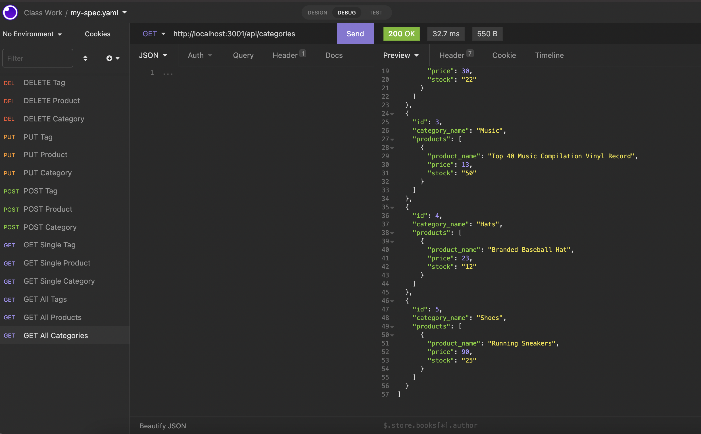

# Challenge #13 - E-commerce Back End

## Description

    This project was about using the package Sequelize to streamline the information from MySQL and allowing the user to manipulate it in a simpler fashion. After the user runs the program within the terminal, they can make GET, POST, PUT, and DELETE requests to manipulate the database accordingly. 

## Experience Gained

    Using Sequelize to work with the database data simplified the amount of code needed to be written. Instead of writing the tables individually, making sure that they were constantly deleted and recreated each time, we only needed to do so for the database itself. The syntax for writing the columns for the table also seemed clearer to me, as it is much more straightforward. Using routes to manipulate the data also felt more official than manipulating the database and tables through MySQL directly.

## GitHub Links (Repository and Demo Video)

    The repository link: https://github.com/ekball/C13-E-Commerce

    The demo video link: https://watch.screencastify.com/v/Q9Imj9urCIiHLs08z6LB

## Demo README

